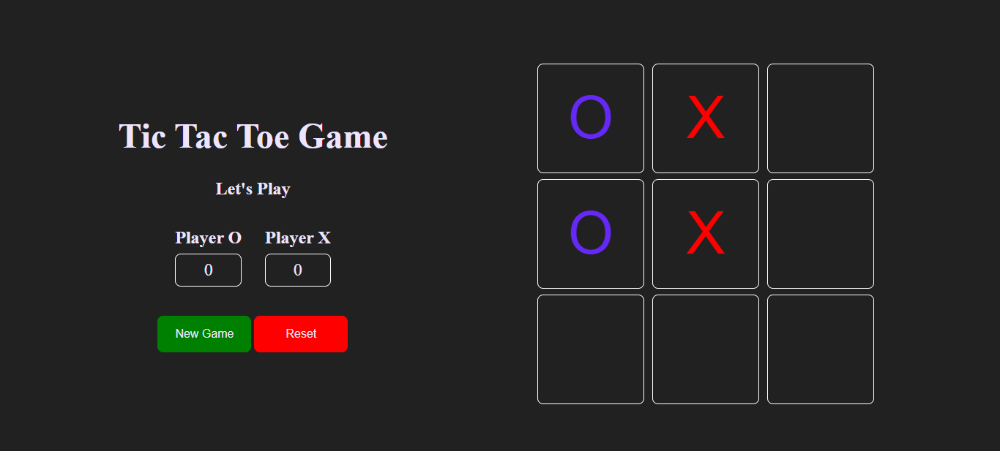

Tic Tac Toe Game

Overview
This is a simple Tic Tac Toe game built to revise concepts of the Document Object Model (DOM). The game is implemented using HTML, CSS, and JavaScript, with a focus on manipulating the DOM to create a dynamic and interactive user experience.

Features
* Classic Tic Tac Toe gameplay.
* Two players take turns to make a move.
* The game detects a win, draw, or continue state.
* Simple and intuitive user interface.

Technologies Used
* HTML5
* CSS3
* JavaScript (ES6)

How to Play
* Open the index.html file in your web browser.
* Two players take turns clicking on the empty squares to make a move.
* The game announces the winner when a player has three in a row, horizontally, vertically, or diagonally.
* If the board is full and no player has won, the game ends in a draw.

Folder Structure
* index.html: The main HTML file containing the game structure.
* style.css: CSS file for styling the game.
* script.js: JavaScript file for game logic and DOM manipulation.

